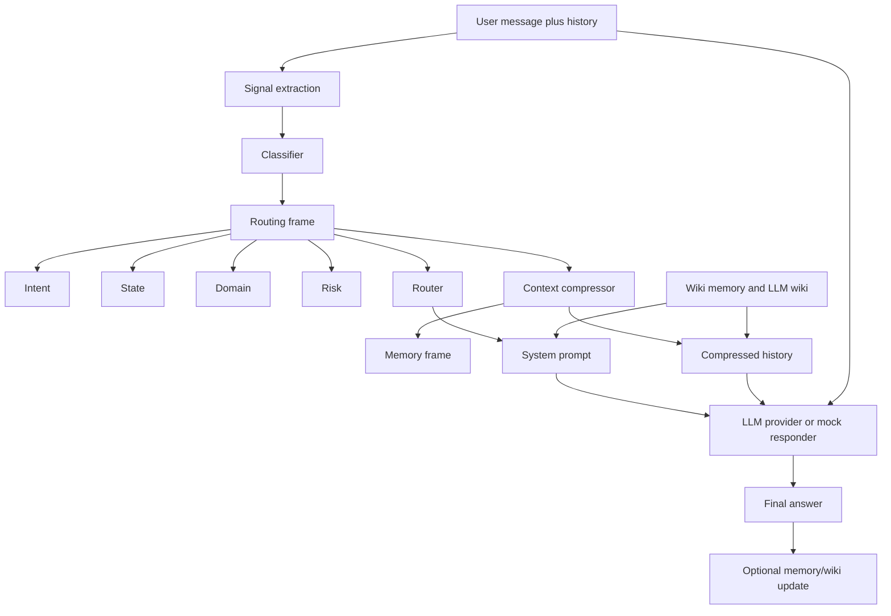

# CTS Knowledge Base

Last updated: 2026-05-05
Repo path: `C:\Users\ASHMITH ATMURI\Documents\Codex\2026-04-29\cts`

## 1. What CTS Is

CTS stands for Contextual Type System / Conversation Type System in this repo. It is a universal interaction-routing layer that sits between a user and an LLM.

CTS is not meant to be the LLM itself. It is the layer that answers:

1. What type of interaction is happening right now?
2. What domain is the user operating in?
3. What stage is the conversation in?
4. Is there risk or policy caution?
5. What parts of history should be kept or compressed?
6. What behavior prompt should the LLM receive?
7. Should memory/wiki context be retrieved or updated?

In plain English:

CTS watches the conversation, classifies the current turn, compresses the old context, creates a behavior prompt, and then sends a cleaner, smaller, better-routed request to the LLM.

The intended value is:

- lower input token cost through compression
- better LLM behavior because the model receives an explicit routing frame
- better continuity through memory/wiki context
- safer behavior for medical/legal/crisis/unsafe contexts
- reusable architecture for many agent products, not only chatbots

## 2. High-Level Flow



## 3. The Core CTS Object: Routing Frame

The main CTS output is a routing frame:

```ts
{
  intent,
  state,
  domain,
  risk,
  signals,
  confidence
}
```

### Intent

Intent means what the user is trying to do.

Supported intent types are defined in `src/cts-core/types.ts`:

- `information_seeking`
- `task_execution`
- `decision_support`
- `comparison`
- `summarization`
- `generation`
- `debugging`
- `escalation`
- `objection_handling`
- `confirmation_seeking`
- `exploration`
- `correction`

Examples:

- `this throws a 401` -> `debugging`
- `write a login function` -> `generation`
- `which laptop should I buy` -> `decision_support` or `commerce`
- `summarize this contract` -> `summarization`

### State

State means where the conversation is in its lifecycle.

Supported states:

- `opening`
- `deepening`
- `pivoting`
- `returning`
- `escalating`
- `resolving`
- `closing`

Examples:

- first user message -> `opening`
- follow-up on same topic -> `deepening`
- user returns after a side topic -> `returning`
- user says it is urgent or still broken -> `escalating`
- user says thanks/done -> `closing`

### Domain

Domain means the area of work.

Built-in domains:

- `general`
- `coding`
- `customer_support`
- `sales`
- `legal`
- `medical`
- `education`
- `commerce`

The system also supports custom domain plugins through `CustomDomainPlugin`.

### Risk

Risk signals are separate from intent and domain. They are not the main identity of the message; they are caution flags.

Supported risk signals:

- `medical_caution`
- `legal_caution`
- `financial_caution`
- `protected_context`
- `unsafe_request`
- `crisis`

Examples:

- medical domain -> add `medical_caution`
- legal domain -> add `legal_caution`
- self-harm or crisis language -> add `crisis` and `protected_context`
- hacking/deleting logs/hiding evidence -> add `unsafe_request`

## 4. What Happens In One CTS Call

### Sync path: `cts()`

Defined in `src/cts-core/index.ts`.

Flow:

1. Receives `message`, optional `history`, optional `wikiContext`, optional custom plugins.
2. Calls `classify()`.
3. Calls `compressHistory()`.
4. Calls `routePrompt()`.
5. Calls `mockRespond()`.
6. Returns `CTSResult`.

This path is deterministic and local. It does not call an LLM.

### Async path: `ctsAsync()`

Defined in `src/cts-core/index.ts`.

Flow:

1. Receives `message`, `history`, optional wiki context, optional plugins, optional responder.
2. Calls `classifyAsync()`.
3. Calls `compressHistoryAsync()`.
4. Calls `routePrompt()`.
5. If a responder is provided, calls the real LLM provider.
6. If no responder is provided, falls back to `mockRespond()`.
7. Returns `CTSResult`.

This is the production-style path because it can use:

- DistilBERT domain classifier
- T5 summarizer compression
- real LLM provider calls

## 5. Main Repo Architecture

```text
cts/
  package.json
  tsconfig.json
  vite.config.ts
  index.html
  docs.html
  use-cases.html

  src/
    cts-core/
      types.ts
      signals.ts
      classifier.ts
      compressor.ts
      router.ts
      mockResponder.ts
      index.ts
      wiki.ts
      llmWiki.ts
      ml-classifier.ts
      ml-t5.ts
      semantic-cache.ts

    server.ts
    providerServer.ts
    apiClient.ts
    llmClient.ts
    main.ts
    admin-ui.ts
    styles.css
    scenarios.ts
    docs.ts
    usecases.ts
    stars.ts

    saas/
      auth.ts
      database.ts
      db.ts

    evals/
      convertLegacyDataset.ts
      datasetEval.ts
      tokenEval.ts
      sessionMemoryEval.ts
      pluginEval.ts

  tests/
    classifier.test.ts
    compressor.test.ts
    integration.test.ts
    llmWiki.test.ts
    router.test.ts
    scenarios.test.ts
    tokenSavings.test.ts
    wiki.test.ts

  ml/
    cts_classifier/
    cts_t5/
    cts_minilm/
    train_colab.py
    train_t5_colab.py
    generate_teacher_summaries.py
    prepare_t5_dataset.py
    download_minilm.py

  data/
    eval outputs
    generated datasets
    local JSON fallback storage

  eval_quality.py
  eval_quality_production.py
  eval_all_datasets.py
  eval_cache.py
  eval_comprehensive.py
  eval_multiwoz.py
  prepare_t5_dataset.py
```

## 6. Core Files Explained

### `src/cts-core/types.ts`

This is the schema file for CTS.

It defines:

- intent types
- state types
- domain types
- risk signal types
- message format
- extracted signal format
- routing frame format
- compression result format
- memory frame format
- route result format
- wiki document format
- LLM wiki format
- input/output types for `cts()` and `ctsAsync()`

This file is the contract of the system.

### `src/cts-core/signals.ts`

This extracts low-level signals from the current message and recent history.

It detects:

- domain keywords
- urgency keywords
- crisis keywords
- unsafe request keywords
- code blocks
- error signals
- comparison markers
- dates/schedules
- price constraints
- affect signals like frustrated/distressed/positive

Important: affect is only a signal. It is not the core identity of CTS.

### `src/cts-core/classifier.ts`

This turns a user message plus history into a routing frame.

It has two paths:

- `classify()` uses deterministic keyword/structure rules.
- `classifyAsync()` uses the local DistilBERT model for domain classification, then rules for intent/state/risk.

The classifier decides:

- domain
- intent
- state
- risk
- confidence scores

Current design:

- DistilBERT handles domain.
- Rule logic handles intent, state, and risk.
- If the ML model fails, CTS falls back to keyword domain rules.

### `src/cts-core/compressor.ts`

This reduces conversation history before sending it to the LLM.

It has two paths:

- `compressHistory()` uses rule-based extraction and natural-language memory-frame serialization.
- `compressHistoryAsync()` tries T5 summarization first, then falls back to the rule compressor.

Compression output includes:

- original history
- compressed history
- memory frame
- reasons for kept content
- dropped count
- original token estimate
- compressed token estimate
- tokens saved

Compression strategy:

- Short histories are kept in full.
- Longer histories get summarized.
- Important recent turns are preserved.
- Coding/support/sales preserve more context.
- Domain-specific fact extraction tries to keep IDs, errors, prices, order numbers, legal/medical facts, etc.

Current limitation:

Rule-based compression can miss facts it was not programmed to recognize. The T5 path is intended to improve this by generating natural-language summaries locally.

### `src/cts-core/router.ts`

This converts a routing frame into behavior instructions and a system prompt.

Intent changes behavior:

- debugging -> root cause first, smallest useful fix
- generation -> produce artifact first
- decision support -> compare criteria and recommend
- escalation -> move quickly toward resolution
- correction -> point out the correction plainly

State changes behavior:

- opening -> establish frame quickly
- deepening -> build on current topic
- returning -> reconnect to earlier context
- escalating -> prioritize speed and clarity
- closing -> be brief and close loop

Domain changes constraints:

- coding -> preserve exact technical details
- customer support -> track issue and resolution
- sales -> be consultative, not pushy
- legal -> no legal advice
- medical -> no diagnosis
- commerce -> respect budget/preferences

Risk adds additional boundaries.

### `src/cts-core/mockResponder.ts`

This generates deterministic sample responses based on the route. It is useful for local demos when no real API key is provided.

### `src/cts-core/index.ts`

This is the public core entrypoint.

It exports:

- `cts()`
- `ctsAsync()`
- classifier functions
- compressor functions
- router
- wiki functions
- ML warmup/health functions
- semantic cache functions
- types

## 7. Memory And Wiki System

CTS currently has two memory concepts.

### Small user wiki: `src/cts-core/wiki.ts`

This stores lightweight user/session patterns.

Fields:

- profile
- patterns
- activeContext
- mistakes
- behavioralSignals
- version
- lastUpdated

It can ingest a chat session and extract:

- common domain
- recent intent
- current work
- stack preferences like TypeScript/Python
- provider interest like OpenRouter
- local-first/APK preference
- recurring blocker patterns

This is simple rule-based memory.

### LLM wiki: `src/cts-core/llmWiki.ts`

This is a larger markdown-style knowledge base.

It stores:

- raw sources
- generated pages
- index markdown
- log markdown
- schema markdown

It supports:

- ingesting a source into pages
- LLM-assisted page generation if a provider is available
- template fallback if no LLM is available
- simple retrieval by keyword scoring
- wiki linting for broken links/source gaps

This is used to create persistent knowledge context across sessions.

## 8. Local ML Models

CTS uses `@xenova/transformers` to load ONNX models locally from the `ml/` folder.

### DistilBERT classifier

Files:

- `ml/cts_classifier/`
- `src/cts-core/ml-classifier.ts`

Purpose:

- classify domain locally
- expose model health
- fallback to rules if loading fails

The model is loaded with task `text-classification` and model name `cts_classifier`.

### T5 summarizer

Files:

- `ml/cts_t5/`
- `src/cts-core/ml-t5.ts`

Purpose:

- generate natural-language compressed memory summaries
- replace brittle regex-only compression over time
- expose model health
- fallback to rule compression if loading fails

The model is loaded with task `text2text-generation` and model name `cts_t5`.

### MiniLM semantic cache

Files:

- `ml/cts_minilm/`
- `src/cts-core/semantic-cache.ts`

Purpose:

- embed user queries
- detect semantically similar repeated questions
- return cached responses when similarity is above threshold
- save output tokens

Cache rules:

- threshold: 0.92 cosine similarity
- max entries: 500
- TTL: 1 hour
- scoped by domain + session ID
- legal domain is not cached because it is too context-specific

## 9. Server/API Layer

Main file: `src/server.ts`

The server is a Node HTTP server. It serves:

- static frontend files from `dist/`
- public demo endpoints
- authenticated API endpoints
- admin endpoints
- health/readiness checks

### Health endpoints

- `GET /health`
  - liveness check
  - says server process is alive
  - includes readiness flag

- `GET /ready`
  - readiness check
  - returns 200 only when required models are loaded
  - currently requires classifier and T5

### Public demo endpoints

- `POST /demo/compress`
  - sync rule-based compression demo
  - no API key

- `POST /demo/compress-async`
  - async ML/T5 compression demo
  - no API key
  - useful for quality evals

- `POST /demo/chat`
  - demo chat endpoint
  - uses `DEMO_LLM_API_KEY` or `GEMINI_API_KEY`
  - checks semantic cache
  - compresses context
  - calls Gemini or OpenRouter fallback

- `POST /demo/request-key`
  - waitlist/API key request form

- `GET /demo/waitlist-count`
  - count pending key requests

### Authenticated API endpoints

Authentication uses `Authorization: Bearer <cts-key>`.

- `POST /api/classify`
  - returns routing frame

- `POST /compress`
  - returns compressed history, route labels, tokens saved, memory frame
  - note: path is `/compress`, not `/api/compress`

- `POST /api/chat`
  - main production-style chat endpoint
  - loads user wiki and LLM wiki
  - calls `ctsAsync()`
  - optionally calls a live LLM provider
  - updates LLM wiki after closing/resolving sessions

- `GET /api/wiki`
  - returns user wiki and LLM wiki

- `DELETE /api/wiki`
  - deletes stored wiki for the API key

- `POST /api/wiki/ingest-chat`
  - ingests a session into small user wiki

- `POST /api/llm-wiki/ingest-source`
  - ingests a source into LLM wiki

- `POST /api/llm-wiki/lint`
  - checks wiki quality issues

- `POST /api/llm`
  - direct provider call wrapper

- `GET /api/usage`
  - returns usage for the authenticated key

### Admin endpoints

Protected by `CTS_ADMIN_SECRET` in `x-admin-secret` header.

- `POST /admin/keys`
  - create API key

- `GET /admin/dashboard`
  - list keys and usage

- `GET /admin/keys/:id/usage`
  - recent calls for one key

- `DELETE /admin/keys/:id`
  - revoke key

- `GET /admin/key-requests`
  - list waitlist/access requests

- `POST /admin/key-requests/:id/fulfill`
  - mark request fulfilled

- `GET /admin/model-health`
  - model readiness
  - startup state
  - classifier/T5/MiniLM health
  - compression fallback stats
  - semantic cache stats

- `GET /admin/cache-stats`
  - semantic cache hits/misses/token savings

## 10. LLM Provider Support

Main file: `src/providerServer.ts`

Supported providers:

- OpenAI-compatible OpenAI API
- Gemini
- Anthropic
- OpenRouter

Provider request shape:

```ts
{
  provider,
  apiKey,
  model,
  systemPrompt,
  compressedHistory,
  message
}
```

CTS sends the LLM:

- routed system prompt
- compressed history
- current user message

Provider-specific behavior:

- OpenAI/OpenRouter use chat completions style.
- Gemini uses `generateContent`.
- Anthropic uses `/v1/messages`.

## 11. SaaS/Auth/Storage Layer

### `src/saas/auth.ts`

Handles:

- Bearer key parsing
- API key lookup
- per-key rate limit: 60 requests/minute
- usage recording

### `src/saas/db.ts`

Handles:

- API key creation
- SHA-256 key hashing
- key lookup
- key revocation
- usage logging
- usage dashboard data
- waitlist/key requests

It supports both:

- PostgreSQL when `DATABASE_URL` is set
- local JSON fallback in `data/` when no database exists

### `src/saas/database.ts`

Initializes PostgreSQL tables:

- `api_keys`
- `usage_log`
- `wiki_store`
- `key_requests`

Also creates useful indexes.

## 12. Frontend App

### `src/main.ts`

Main browser UI logic.

It powers:

- landing/demo chat UI
- routing frame display
- waitlist form
- API usage dashboard
- quickstart tab switching

The demo chat calls `/demo/chat` and displays:

- domain
- intent
- state
- confidence
- risk
- tokens saved

### `src/admin-ui.ts`

Generates admin dashboard HTML for key/admin management.

### `src/apiClient.ts`

Client helper functions for API calls.

Note: some functions still include `userId` query/body assumptions, while the server now primarily uses authenticated API key ID as the user ID.

### Other frontend files

- `src/styles.css` - UI styling
- `src/stars.ts` - starfield visual effect
- `src/scenarios.ts` - demo scenarios
- `src/docs.ts` - docs page logic/content hooks
- `src/usecases.ts` - use cases page logic/content hooks

## 13. Evaluation And Testing

### TypeScript evals in `src/evals/`

- `datasetEval.ts`
  - tests classification/compression against JSONL datasets

- `tokenEval.ts`
  - measures token savings behavior

- `sessionMemoryEval.ts`
  - tests whether memory can carry facts across sessions

- `pluginEval.ts`
  - tests custom domain plugin behavior

- `convertLegacyDataset.ts`
  - converts older dataset formats

### Python eval scripts

- `eval_quality.py`
  - older quality eval comparing full history vs CTS compressed answer
  - originally targets `/demo/compress`

- `eval_quality_production.py`
  - newer production quality eval
  - intended to target `/demo/compress-async`
  - compares full-history LLM answer vs CTS-compressed LLM answer
  - uses judge LLM to decide whether CTS is equal/better/worse

- `eval_all_datasets.py`
  - broad dataset evaluation

- `eval_comprehensive.py`
  - wider comprehensive evaluation

- `eval_cache.py`
  - semantic cache evaluation

- `eval_multiwoz.py`
  - MultiWOZ/dialogue dataset evaluation

- `prepare_t5_dataset.py`
  - prepares T5 compression datasets

### Unit tests in `tests/`

- `classifier.test.ts`
- `compressor.test.ts`
- `integration.test.ts`
- `llmWiki.test.ts`
- `router.test.ts`
- `scenarios.test.ts`
- `tokenSavings.test.ts`
- `wiki.test.ts`

Run tests:

```powershell
npm test
```

Build:

```powershell
npm run build
```

Run API server:

```powershell
npm run api
```

Run frontend dev server:

```powershell
npm run dev
```

## 14. Data And Model Files

### Root dataset files

Large datasets are present in the repo root:

- `coding.json`
- `customer_support.json`
- `sales.json`
- `commerce.json`
- `general.json`
- `medical.json`
- `education.json`
- `hospitality.json`
- `multiwoz.json`

These are used for classifier/compressor/eval preparation.

### `data/`

Contains:

- generated eval datasets
- eval result JSON files
- eval dashboard HTML files
- T5 compression train/val/test JSONL files
- local JSON fallback DB files when running without Postgres

Important examples:

- `data/cts_evaluation_dataset.jsonl`
- `data/cts-v5-results.json`
- `data/cts-v5-dashboard.html`
- `data/quality_results.json`
- `data/t5_compression/train.jsonl`
- `data/t5_compression/val.jsonl`
- `data/t5_compression/test.jsonl`

### `ml/`

Contains:

- trained DistilBERT classifier
- trained T5 summarizer
- MiniLM semantic embedding model
- Colab training scripts
- teacher-summary generation scripts
- ONNX exports

Important scripts:

- `ml/train_colab.py`
- `ml/train_t5_colab.py`
- `ml/prepare_dataset.py`
- `ml/prepare_t5_dataset.py`
- `ml/generate_teacher_summaries.py`
- `ml/download_minilm.py`
- `ml/merge_t5_decoder.py`

## 15. Current Product Readiness State

What exists now:

- local TypeScript CTS core
- browser demo
- API server
- API key auth
- usage tracking
- local JSON fallback storage
- optional Postgres storage
- user wiki memory
- LLM wiki memory
- local DistilBERT domain classifier
- local T5 summarizer path
- MiniLM semantic response cache
- quality eval scripts
- admin dashboard and model health endpoints

What still needs proof before production:

1. Response quality must be measured on the async path.
   - Token savings alone is not enough.
   - The real metric is whether CTS-compressed answers are equal or better than full-history answers.

2. Model deployment strategy needs to be decided.
   - Classifier + T5 + MiniLM can be heavy for small Railway instances.
   - Production needs either larger RAM, fewer models loaded, or separate model serving.

3. Model files must exist in production.
   - If model files are not deployed or downloaded, CTS falls back to rules.

4. Medical/legal should be treated carefully.
   - If quality evals are weak, these domains should use conservative/no compression.

5. Memory permissions are not fully hardened.
   - There is wiki/memory storage.
   - But protected-zone style enforcement is not a deep architectural permission layer yet.

6. Some code has grown experimental surfaces.
   - There are several eval scripts and versions.
   - The next cleanup should separate stable product code from research/eval code.

## 16. The Core Value Proposition

CTS is valuable when an AI product has long or repeated conversations and the LLM should not receive raw history every time.

CTS adds value by:

- classifying the current turn
- deciding the correct behavior style
- preserving important history
- removing irrelevant history
- saving input tokens
- retrieving memory/wiki context
- adding domain/risk constraints
- making responses more consistent across agents

For a coding assistant, CTS can distinguish:

- architecture planning
- code generation
- debugging
- correction
- explanation
- returning to an earlier bug

For support, CTS can distinguish:

- complaint
- escalation
- refund/resolution seeking
- information seeking

For sales, CTS can distinguish:

- discovery
- comparison
- objection handling
- closing/resolving

For medical/legal, CTS does not try to become a doctor/lawyer. It flags caution and changes the prompt constraints.

## 17. Mental Model

Think of CTS as a conversation operating system layer.

The LLM is the engine. CTS is the traffic controller.

CTS decides:

- what road the request is on
- what rules apply
- what context needs to travel with it
- what can be left behind
- whether memory should be retrieved
- whether the situation is risky

Then the LLM answers with a cleaner context window.

## 18. Recommended Next Steps

1. Run production quality eval on `/demo/compress-async` with low concurrency.

```powershell
npm run api
```

Then in another terminal:

```powershell
$env:GEMINI_API_KEY="YOUR_KEY"
python eval_quality_production.py --provider gemini --samples 20 --workers 1
```

2. Read the result file and check:

- overall CTS OK rate
- OK rate by domain
- average token savings
- cases where full history beat CTS

3. Decide compression policy per domain:

- high quality domains: allow compression
- weak domains: conservative compression
- high-risk weak domains: no compression or keep more turns

4. Clean the repo into stable vs research folders:

```text
src/               stable product code
research/          datasets, evals, experiments
ml/                model training/export/runtime assets
docs/              architecture and KB docs
```

5. Decide deployment model:

- all models in same Node server
- model service split out
- disable semantic cache first
- use external LLM summarization instead of local T5

## 19. One-Sentence Summary

CTS is a universal routing, compression, memory, and safety layer that helps an LLM understand what kind of interaction is happening, keep only the context that matters, and respond with the right behavior for the current domain and conversation state.
